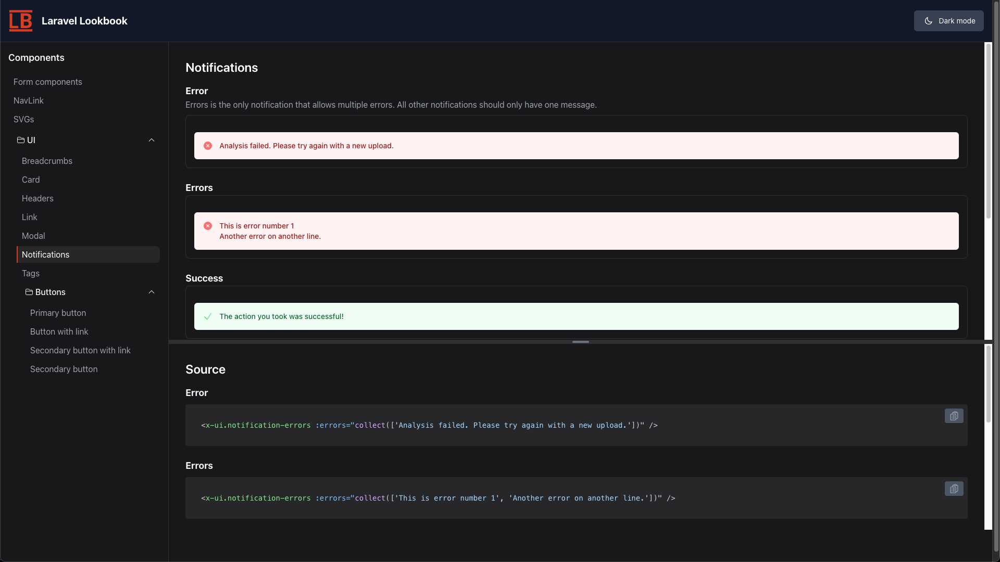

# Laravel Lookbook

Laravel Lookbook is a component development environment for Laravel that helps you build, document, and organize your **Blade components** in isolation. Preview different component states, document usage examples, switch between light and dark modes to verify your components - all while working in your Laravel application. Inspired by the Ruby on Rails Lookbook gem, this package brings the same powerful component development workflow to the Laravel ecosystem.

<div style="display: flex; justify-content: space-between;">
  <div style="text-align: center;">
    <a href="images/screenshot-dark-mode.png" target="_blank">
      
    </a>
    <p>Lookbook with notification components in dark mode</p>
  </div>
</div>

## Features

- **Component Previews**: Render and display Blade components with their output.
- **Multiple Component Versions**: Show different versions/states of the same component. (i.e., primary button, secondary button, etc.)
- **Source Code Display**: View the Blade source code used to render the components.
- **Collapsible Folders**: Organize components in collapsible category folders
- **Light/Dark Mode**: Switch between light and dark themes for better visibility.
- **Component Generator**: Artisan command to scaffold new component previews
- **Markdown Documentation**: Add markdown-formatted notes to your components


## Installation

1. Install the package via Composer:

```bash
composer require --dev smitmartijn/laravel-lookbook
```

2. Publish the configuration file and views:

```bash
php artisan vendor:publish --provider="LaravelLookbook\LookbookServiceProvider"
```

3. Update the configuration file located at `config/lookbook.php` to optionally customize the route and other settings.

4. Visit `/lookbook` to check out the interface!

5. Optionally, add `"./app/Lookbook/**/*.php",` to the `content` array in `tailwind.css.js`, if you are going to be using classes in the component preview files.

## Usage

- Access the Lookbook interface at the configured route (default: `/lookbook`).
- Organize your Blade component previews in the `app/Lookbook` directory.
- Create component preview files to define how each component is displayed in the previews.

### Creating component previews

1. Create a component preview

```
# php artisan make:lookbook-component Button
Lookbook component created successfully in app/Lookbook/Button.php
```

2. Edit the created component preview model (`app/Lookbook/Button.php` in example) to include the code for your Blade component. For example:


```php
<?php

namespace App\Lookbook;

use LaravelLookbook\Support\ComponentPreview;
use Illuminate\Support\Facades\Blade;

class Button extends ComponentPreview
{
   /**
    * @name Primary button
    * @notes This is the button style you should use for most things.
    */
   public function primary()
   {
      return (string) Blade::render(<<<'HTML'
<x-button type="submit">
   Button Text
</x-button>
HTML);
   }

  /**
   * @name Success button
   * @notes
   * Use this button style when a form is filled out successfully, or we want to encourage users to click this.
   *
   * This style uses a `#008000` green color
   */
   public function success()
   {
      return (string) Blade::render(<<<'HTML'
<x-button type="submit" color="success">
   Link Text
</x-button>
HTML);
   }
}
```

Notes:
- You can have as many functions inside the component preview files as you want.
- The phpdoc block is optional. Without a `@name` the function name will be used as the component preview name.
- The component name will be derived from the class name, but you can override it by adding a function to the class:

```php
class Button extends ComponentPreview
{
   static public function getName()
   {
      return 'Button Component';
   }
   ...
}
```

## Contributing

This package is in early stages, and contributions are welcome! Please open an issue or submit a pull request for any enhancements or bug fixes.

## Testing

Run the tests with:

```bash
composer test
```

## License

This package is licensed under the MIT License. See the LICENSE file for more information.